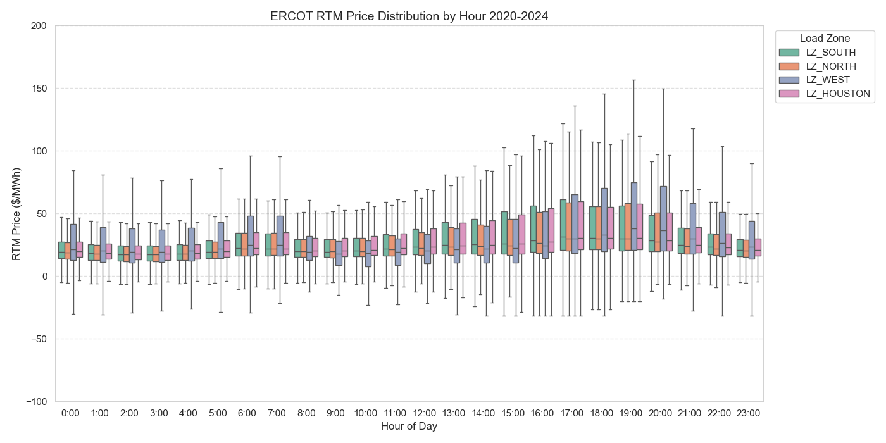
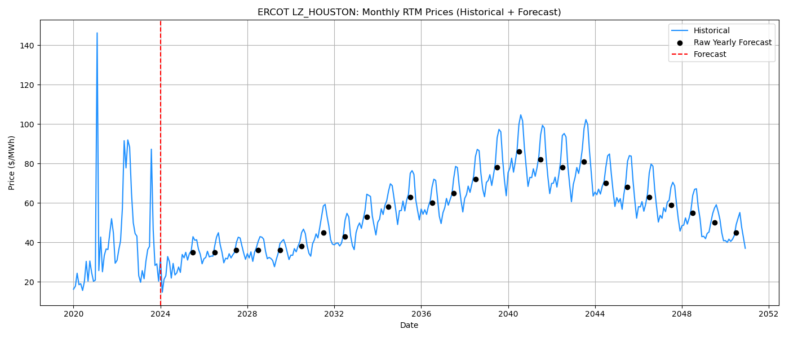
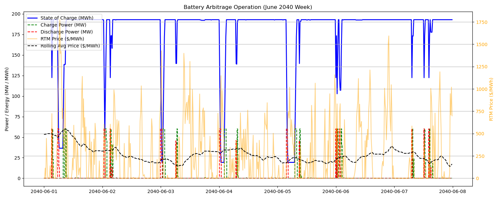

# ERCOT Battery Revenue Model

This project was developed as part of my MSc at Imperial College London to examine the investment viability of a utility-scale battery operating in the ERCOT electricity market.

The model combines historical real-time market data with forward price simulation to generate 15-minute price paths and evaluate battery dispatch strategies.

It estimates revenue from energy arbitrage and ancillary services while accounting for operational constraints such as:

- power limits  
- state of charge constraints  
- degradation costs  
- cycling limits  

The objective is to simulate how a battery could operate under realistic market conditions and estimate potential revenue streams.

---

## Model Architecture

The model follows a pipeline structure:

1. Load and clean historical ERCOT RTM price data  
2. Extract seasonal price patterns and volatility  
3. Generate forward price paths using statistical simulation  
4. Simulate battery dispatch based on price signals  
5. Calculate revenue streams and financial performance  

The dispatch model evaluates two main revenue sources:

- Energy arbitrage
- Ancillary services

---

## Battery Assumptions

| Parameter | Value |
|----------|------|
Energy Capacity | 240 MWh |
Power Capacity | 60 MW |
Round-trip Efficiency | 85% |
Minimum SOC | 10% |
Maximum Cycles | 1 per day |
Degradation Cost | $10 / MWh throughput |

---

## Revenue Breakdown

---

## Price Projection

---

## Example Battery Dispatch

---

## Limitations

This model simplifies several aspects of real battery trading:

- Perfect price foresight within the dispatch horizon  
- Simplified ancillary service activation logic  
- No network constraint modelling  
- No real bidding strategy or market clearing simulation  

Future work could include stochastic optimisation and market-specific bidding strategies.

---
